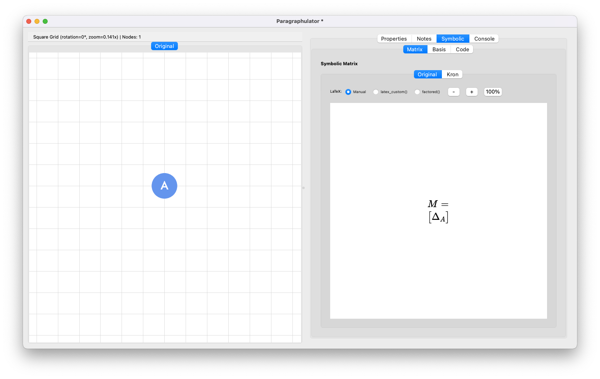
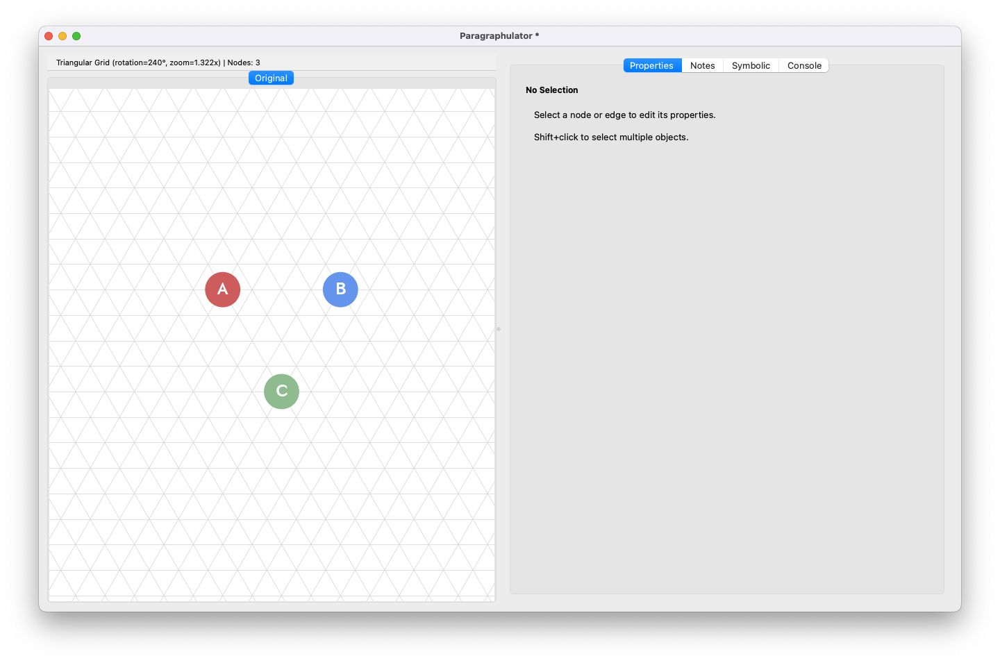
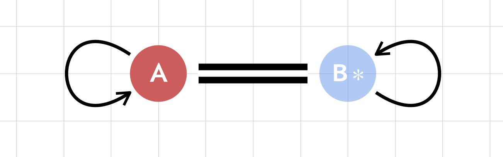
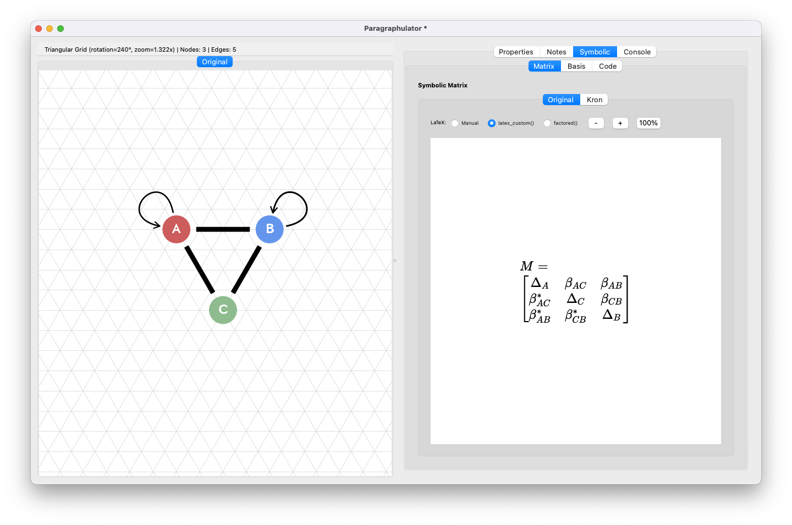
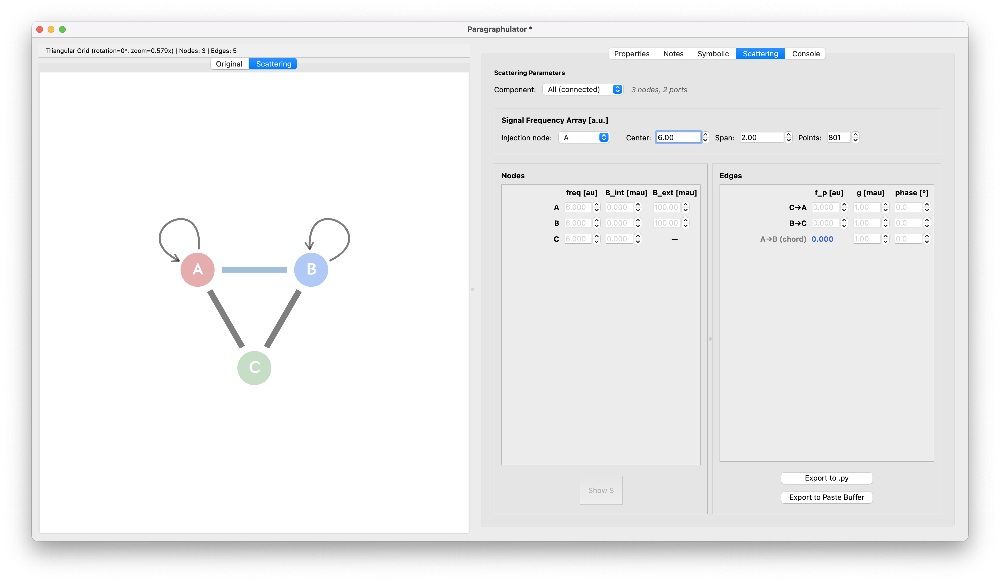
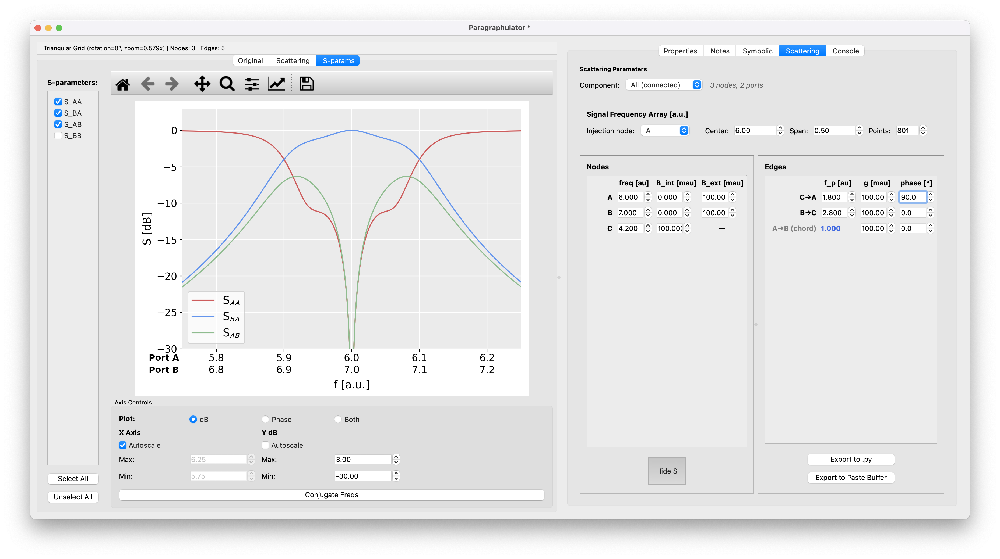

# Paragraphulator Tutorial
Welcome to the Paragraphulator! This tutorial will guide you through the basics of creating and analyzing graphs.

## Getting Started

The Paragraphulator is a visual tool for creating graphs and computing their associated equation-of-motion matrices. It's particularly useful for studying resonant and parametrically coupled modes. It allows a user to draw a graph encapsulating the equations of motion for a driven coupled mode system like a multipole filter, parametric frequency converter, parametric amplifier, etc., and compute the corresponding scattering matrix very quickly. The graph approach to parametric coupled mode theory is given in several publications, notably *Graph-based analysis of nonreciprocity in coupled-mode systems* by L. Ranzani & J. Aumentado, New J. Phys. **17**, 023024 (2015) while the specific graphical elements we use here are the abridged version outlined in *Synthesis of parametrically coupled networks* by O. Naaman & J. Aumentado, PRX Quantum **3**, 020201 (2022).

### The Interface

The main window is divided into three areas:

- **Left panel**: Holds the graph canvas (*Original* tab) where you draw the coupled mode graph. Additional tabs appear to setup and show calculated scattering parameters.
- **Right panel**: Properties, symbolic matrix displays, and parameter assignment for setting up scattering calculations.

The interface if largely oriented around keyboard shortcuts to simplify the GUI which puts the burden on the user to remember a lot of shortcuts. They're not so bad but you can always open help (*Help/Show Help*) to get the shortcut list.

---

## Creating Your First Graph
Let's create a three mode frequency converting isolator (as discussed in, e.g.,  *Ranzani/Aumentado*, *Naaman/Aumentado*).

### Placing Nodes
In graph coupled mode theory, a driven mode is represented by a node in a graph.

1. Press {{shortcut:node.place_single}} to enter single node placement mode
2. Click on the canvas to place a node.
3. A window will pop up that shows various options to tweak the appearance. Note that the label defaults to `A` although the user can choose anything, including latex-formatted greek letters and subscripts.

*Automatic node labeling.* The program will make an effort to label subsequently placed nodes sequentially based on the last node label, including the last node label that has been modified. If there are redundant labels, these will be highlighted with salmon-colored rings. These need to be fixed such that all nodes are uniquely labeled to define a valid mode basis.

*Symbolic matrix and basis rendering.* The *Symbolic/Matrix* tab in the right panel will update to show the equation of motion matrix that corresponds to the drawn graph. Type {{shortcut:tab.matrix}} to bring the matrix into view. Likewise, the basis is listed in the *Symbolic/Basis*. This just shows the node labels as a vector to indicate how the modes are ordered in the basis. Importantly, the user can reorder the basis by pressing the *Enter Basis Ordering Mode* button at the bottom of the *Symbolic/Basis* tab. In Basis Ordering Mode, all nodes will highlight and you can select them in whatever order you like. This is convenient when trying to group modes in some more natural way, e.g., separating into more/less connected subgraphs that might express different functionalities. In both *Matrix* and *Basis* subtabs, you can right-click the rendered equations to get

For anything bigger than two modes the popup dialog is cumbersome and it's more convenient to enter Continuous Node Placement Mode. Press {{shortcut:node.place_continuous}} and a ghost node (labeled `?`) will show up under the cursor, allowing you to click to place subsequent nodes on the snap grid. While in this mode:

4. Place two more nodes. These should automatically increment their labels, e.g., if the first node label is *A* then the following will be *B*, *C*, etc. Likewise, if $A_0$, then the following will be $A_1$, $A_2$, etc.

> [!TIP]
> There are two flavors of snap grid-- square and triangular. Press {{shortcut:grid.toggle_type}} to switch between the two. Press {{shortcut:grid.rotate}} to rotate by either 45 or 60 degrees depending on the grid.

5. Switch to a triangle grid and place your three modes in a triangle.

*Node appearance.* The node appearance can be customized. For convenience you can right-click a node to set it's color, but other settings can be tuned using the Properties tab in the right panel. You can also Shift-click several nodes to select them and change all of their colors simultaneously.

6. Right-click the nodes and set unique colors.

You should now have something that looks like this:

### Connecting Nodes with Edges
A meaningful graph will have coupling, indicated by edges.

1. Press {{shortcut:edge.place_continuous}} to enter Continuous Edge Placement Mode. As you might have guessed, {{shortcut:edge.place_single}} will allow you to place a single edge, but we're usually placing multiple edges.
2. Click on the first node (source)
3. Click on the second node (target)
4. An edge will be created.

Proceed to connect the full triangle (3 edges).

At this point we're ready to setup a scattering calculation based on the three-mode circulator graph.

> [!TIP]
> {{shortcut:edit.undo}} will undo edge and node placements. {{shortcut:node.exit_placement}} will escape out of node or edge placement mode.

> [!NOTE]
> One of the central features of coupled mode graphs is amplifier-type coupling, i.e., mixing between positive and negative frequencies. Modes that are rotating at negative frequencies are *conjugated*, e.g., $a[\omega]\rightarrow a^\dagger[-\omega]$. When an unconjugated mode is coupled to a conjugated mode, e.g., $a[\omega_A^s] \leftrightarrow b^\dagger[-\omega_B^s]$ it is represented by a node with opaque coloring (`A`) coupled to one that is transparent (`B*`) with a double-line edge.
> 
> See *File/Examples/AMP_BA*

---

## Scattering
To compute scattering we need to assign resonator frequencies, dissipation rates, coupling rates, and coupling phases.

This allows you to:

- Assign numerical values to node and edge parameters
- Define frequency ranges for S-parameter computation
- View computed scattering matrices

### Defining Ports with Self-loops
Before assigning parameter values we have to define ports where input/output waves can access the system. In this case we'll just focus on two-mode scattering between `A` and `B`. To do this we'll place *self-loops* on the `A` and `B` nodes, following the convention in Naaman & Aumentado. Self-loops are just edges where the source and target nodes are identical. While in Continuous Edge Placement Mode,
1. Click on the `A` node twice
2. Click on the `B` node twice

If you like you can rotate the self-loops by clicking on each and using the {{shortcut:selfloop.angle_decrease}}/{{shortcut:selfloop.angle_increase}} keys. Your graph should look like this,

### Enter Scattering Mode
Press {{shortcut:analysis.scattering}} to enter scattering mode (or via *Action/Enable Scattering*). This will reveal a new *Scattering* view tab in the left panel and a *Scattering* tab in the right panel. The right panel *Scattering* tab will have several spinbox widgets for setting numerical values for the modes and couplings. You should see something like this:

For nodes/modes we have to define the natural frequency (*freq*), internal (*B_int*) and external dissipation rates (*B_ext*). For edges/couplings we have to define the pump frequency (*f_p*), coupling rate (*g*), and the pump phase (*phase*). At the top of the panel we can see the stimulus frequency array settings as well as the 'injection node'. The injection node is a bit of a technicality, but is essentially the root of a spanning tree determined for the graph.

> [!NOTE]
> The frequencies, dissipation rates, and coupling rates are scaled differently *and* everything is in arbitrary units (a.u.). The dissipation and coupling rate values are multiplied by 1000x, i.e., in (milli-a.u.). This is because typical values of dissipation and coupling rates are much smaller than the resonator natural frequencies we talk about in microwave systems. The fact that we've chosen arbitrary units has to do with the fact that $2\pi$s drop out of the equations and the overall scale GHz vs THz vs Hz also drops out. If it helps, you can think of your *a.u.* as GHz and *ma.u* as MHz.

### Assigning values
On the left you will see a slightly transparent version of the graph, while on the values in the spinboxes on the right are grayed out. As you tab through the spinboxes and assign values by entering numbers or just hitting `Enter`, these values will become black type. Completion of individual node and edge parameters is indicated by increased opacity in the displayed graph in the left side *Scattering* canvas.

1. Define all of the node parameters with the following values (assuming you stuck with the **A**, **B**, **C** notation):

| *Mode* | *freq* | *B_int* | *B_ext* |
|--------|--------|--------|--------|
| A | 6.0 | 0.0 | 100.0 |
| B | 7.0 | 0.0 | 100.0 |
| C | 4.2 | 100.0 | 100.0 |

2. Define  all of the edge parameters with the following values:

| *Edge* | *f_p* | *g* | *phase* |
| ------ | ------- | ------- | ------ |
| C - A | 1.80 | 100.0 | 0.0 |
| B - C | 2.80 | 100.0 | 0.0 |
| A - B | *auto: 1.0* | 100.0 | 0.0 |

> [!NOTE]
> When a graph has a closed loop ('cycle') it's redundant to define all of the pump frequencies for all edges in the loop, so the last edge (depending on the computed spanning tree) will be computed for you. In graph terms, this edge is called a *chord*. Chords are denoted as blue in the Scattering tab graph view.

> [!NOTE]
> *What's the deal with adding internal loss to mode **C**?* The external loss parameter *B_ext* is how energy gets in and out of the system via the attached ports. For a circulator we need loss at all ports, but since we do not explicitly list a port on *C* there is no external loss to couple to. Since all that matters is having loss and the total loss *B_tot = B_int + B_ext* we just assign the loss to *B_int*.

Note that we've defined the pump frequencies to span the difference in the **A**/**B**/**C** resonator natural frequencies exactly to define a perfect parameteric circulator. At this point your graph should be fully defined.

3. Press the *Show S* button (below the Nodes spinbox panel). Alternatively, type {{shortcut:tab.toggle_sparams}}. This will show the scattering parameters vs. send/receive frequencies.

4. Turn off
    - the `S_BB` checkbox (in the upper left)
    - the **Y dB**  *Autoscale* checkbox (at the bottom)

5. Set the *Y* axis limits to *min: -30.0* and *max: 3.00*.

6. Click into the *Signal Frequency Array Span* entry box and change the value by using the `Up/Down` arrow keys.

7. Click into any of the Edge phase spinboxes and use the `Up/Down` arrow keys to change the phase from *0.0* to $\pm90.0$.

You should see something like this:

> [!TIP]
> The spinbox values can be directly typed into the box or adjusted with either the little up/down buttons or just using the `Up/Down` arrow keys (with the spinbox entry box selected).

In the parametric circulator, the directionality is set by the so-called *loop phase* which is tuned by the sum of the individual pump phases. Setting the total loop phase to $\pi/2$ (90 degrees) breaks the transmission symmetry s.t. $S_{AB}\neq S_{BA}$. Play with phase and watch the difference between $S_{AB}$ and $S_{BA}$ change.

#### Constraining values
It is often useful to constrain parameters to the same value. You can do this in the *Scattering* tab (right panel) by `Right+Click`ing a spinbox and creating a *Constraint Group*. You can add any spinbox to an already-existing constraint group. Constrained values will have a colored background to visually indicate what group they belong to. When you change a value in a group, all of the parameters within that group will change with it.

> [!NOTE]
> Whenever a fully valid graph is defined (all numerical parameters set), *any* change to a parameter will trigger a recalculation of the scattering, giving a live update showing what that change did.

## Exporting code
The GUI provides some mechanisms for exporting relevant python code, including:
- *graph drawing code*: *File/Export/Python Code* will export code to the paste buffer that you can paste directly into python or a python Jupyter notebook for execution. This code will use the `graph_primitives.py` module to plot the displayed graph. This is good if you want to generalize a graph and use as a basis for drawing more complicated graphs for presentations. Otherwise, if you just want a nice image you can use the other export formats under *File/Export* such as SVG, PDF, and PNG.
- *SymPy code*: If you want to do more sophisticated analysis on the equation-of-motion (EoM) matrix itself, you can export the SymPy code directly (again, to the paste buffer) from the *Symbolic/Code* subtab in the right panel, using the *Export SymPy Code to Paste Buffer* button at the bottom.
- *LaTeX markup*: If you want to write out the EoM matrix in a document, you can `Right-Click` the displayed matrix and copy the LaTeX markup directly. This is good for complicated expressions that are tedious or error-prone to type out by hand.
- *Scattering calculation code*: The scattering calculation code is fully exportable as python code. In the *Scattering* tab in the right panel, there are export buttons to either create a python file or just export to the paste buffer. The latter is nice for pasting into a Jupyter notebook. The code utilizes the `graphulator.autograph` module and the `GraphScatteringMatrix` class to automatically parse a graph into a scattering calculation. It's useful to use as a base example if you want to generate more complicated, larger graphs and calculate scattering automatically.

## Annotation
You can annotate your graphs in the *Notes* tab in the right panel. Use the *Edit* subtab to write markdown and *Preview* to render it. Currently you can't paste images into the markdown, but it's still useful for documentation.

## Kron reduction
You can reduce out parts of a matrix using Kron reduction (a.k.a., comuting the Schur complement. Enter Kron reduction mode ({{shortcut:analysis.kron_mode}} or *Action/Start Kron Reduction*) and (in the *Original* tab view) all of the nodes will highlight with red rings. Select the nodes that you want to keep in the basis one-by-one (the red rings will turn to green). When you are done press {{shortcut:analysis.commit_mode}} to commit the selection. The EoM matrix in the reduced basis will appear in the *Symbolic/Matrix/Kron* subtab. Likewise, the old and new basis vectors will be displayed in the *Symbolic/Matrix/Basis* subtab.

## Disconnected Graphs
It's sometimes nice to compare the scattering results between two different graphs. The Paragraphulator provisions for this by letting the user specify two disconnected graphs and plotting the scattering results on one plot.

See *File/Examples/FC_COMPARISON_2* for an example.
---

## Keyboard Shortcuts

Here are the most commonly used shortcuts:

| Shortcut | Action |
|----------|--------|
| {{shortcut:node.place_single}} | Place single node |
| {{shortcut:node.place_continuous}} | Continuous node mode |
| {{shortcut:edge.place_single}} | Place single edge |
| {{shortcut:edge.place_continuous}} | Continuous edge mode |
| {{shortcut:view.auto_fit}} | Auto-fit view |
| {{shortcut:edit.undo}} | Undo |
| {{shortcut:edit.delete}} | Delete selection |
| {{shortcut:file.save}} | Save graph |
| {{shortcut:help.show}} | Show help |
| {{shortcut:tab.switch_1}}/{{shortcut:tab.switch_2}}/{{shortcut:tab.switch_3}} | Displays the first/second/third tabs available in the left panel |

For a complete list, press {{shortcut:help.show}} to open the Help window.

---

## Tips and Tricks

- **Selection**: Click and drag to create a selection box around multiple nodes
- **Multi-select**: Hold `Shift` while clicking to add to selection
- **Adjust sizes**: With nodes selected, use `Up/Down` arrows to resize, `Left/Right` for label size
- **Rotate/Flip**: Rotate selected nodes with {{shortcut:rotate.ccw}}/{{shortcut:rotate.cw}}, or flip horizontally/vertically with {{shortcut:graph.flip_horizontal}}/{{shortcut:graph.flip_vertical}}
- **Panning**: You can pan the graph canvas using the arrow keys
- **Zoom In/Out**: Zoom in and out using the {{shortcut:view.zoom_in}}/{{shortcut:view.zoom_out}} keys.
- **Zoom All**: At any point you can zoom all with {{shortcut:view.auto_fit}}.
- **Spinbox value incrementing**: When setting a spinbox value, you use the arrow buttons, type the value, or click into the entry box and use the `Up/Down` arrow keys. `Shift+Up/Down`  increments by 10x smaller values, while `Ctrl+Up/Down` increments by 10x larger values.

---

## Next Steps

- Explore the **Examples** menu for pre-built graphs
- Read the full **Help** documentation ({{shortcut:help.show}})
- Experiment with different graph topologies
- Try the Kron reduction feature ({{shortcut:analysis.kron_mode}}) for simplifying graphs

If you have comments or questions about this tool, please open an issue on GitHub: https://github.com/w00ber/graphulator/issues

Happy graphing!

<!-- EXAMPLES of callout boxes
> [!TIP]
> This is a helpful tip for users.

> [!NOTE]
> This is additional information.

> [!WARNING]
> Be careful about this.

> [!CAUTION]
> Similar to warning, use for potential issues.

> [!IMPORTANT]
> Critical information that users should know.
-->
